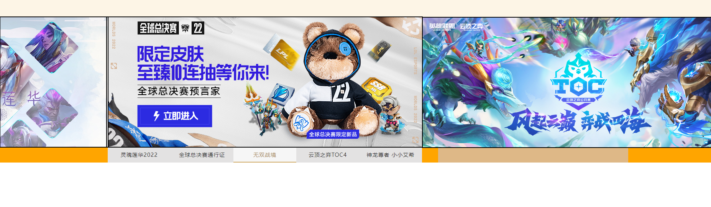

# LOL 网页

## banner部分

3种实现方式（原生JS）
1. 将 `ul` 的 `li` 排成一整行 `img left[0, -100%, -200%...]`
2. **(当前使用)** `li` 有3个位置，当前展示的图片`(index)`  `left: 0`， `(index < current) left: -100%` `(index > current) left: 100%`
3. 无限轮播
4. opacity 图片叠在一块，通过修改透明度

`https://apps.game.qq.com/cmc/zmMcnTargetContentList?r0=jsonp&page=1&num=2&target=25`

`page` 页码
`num`  每一页的数量

target :
23 综合
24 公告
25 赛事
27 攻略
28 社区